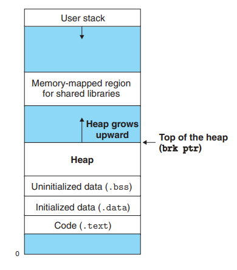

# Memory-allocators
Educational repository to briefly go over practical implementations of memory allocators and theoretical background of them.

# Why?
Why do we care about memory allocators? Memory allocators are an interface that allow us to preform *dynamic memory allocation* which is when we store long lived values in a programs' memory that is **not** the stack which is automatically sized at compile-time, the size of dynamically allocated memory is deteremined at run-time. 

# How?
Memory allocators (typically) utilize a part of processes' memory space called the "heap". We can dynamically allocate data onto the heap in 2 main ways on linux:
  * mmap system call: Maps a chunk of memory that is utilized by our program that we store in between the data segment (.rodata, .text and what not) and the stack. See figure.1 for visualization.
  * sbrk function: Alters the program break to allocate space directly above the data segment. (Program break is a pointer to the top of the data segment on the first allocation but after allocations it'll be a pointer to the top of the heap). See figure.1 for visualization.

# Addressing space visualization:

figure1.

The "memory-mapped region" stores mmap'd chunks.
The section labeled "heap" stores the sbrk allocated chunks.

Sbrk is ideal for allocating smaller chunks because it consists of simply adding or subtracting from a pointer.
Mmap is ideal for really large chunk alloctations that are around 4096 bytes worth of allocation space.

# What's the heap?
We threw the word "heap" around a lot, but actually is the heap? The heap is a sesction of memory in our process that is constructed through the utilization of those functions / system calls we mentioned. Values stored on the heap are loaded at runtime.

# Types of memory allocators:
So lets get into what they actually look in code and their types.

## Linear allocator / bump allocators / arena allocators:
Linear allocators are allocators that allocate a chunk of memory deteremined by a given size that you index into with a pointer. You generally keep track of 3 different points. A pointer to the start of the allocated buffer, a current pointer that keeps track of the current pointer we have into the memory space. And an end pointer to make sure we don't write the current pointer past the memory space we defined.

### Allocation:
### Deallocation:
### Pros:
### Cons:

## Free list allocators:
Free-list allocators are a technique for memory allocators where we store the allocation chunks in a linked list. The linked list nodes would generally contain a size field (keeps track of the size of the chunk), is freed field (to determine if the currently looked at chunk is free or not), and a next pointer (next node in the linked list). Now there are 2 types of free-list allocators, those being: explicit and implicit free lists.

* Implicit free list: Implicitly defines a structure of chunks that strictly points to free'd nodes.
* Explicit free list: Explicitly defines a structure of chunks that contain free and used nodes and are differentiated between with a flag determining if the currently loked at node is free or not.

### Allocation:
### Deallocation:
### Pros:
### Cons:

# Why would we write our own?

# Implementations:
